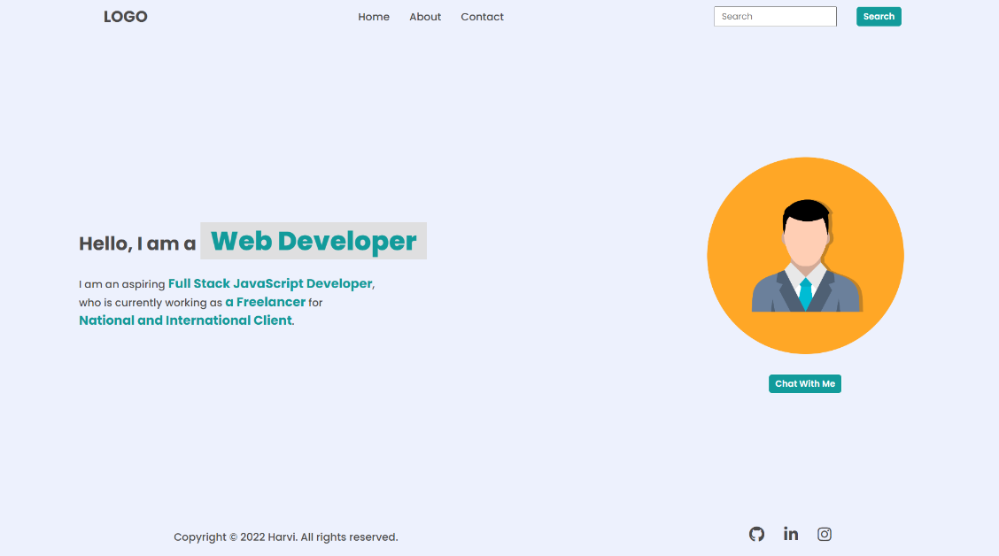
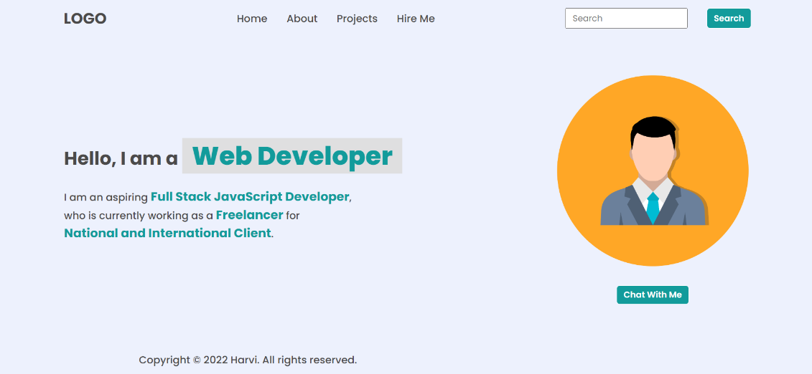
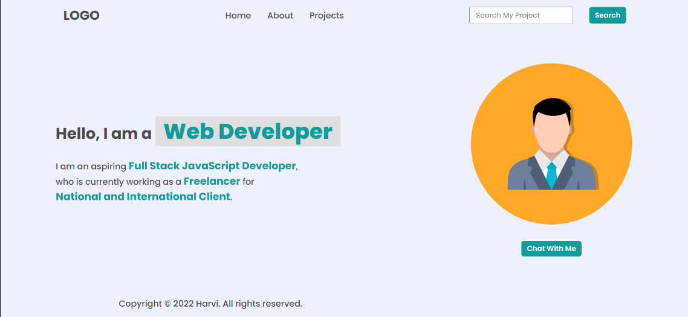
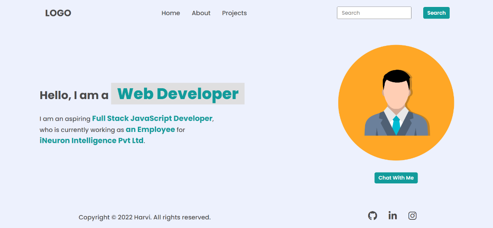
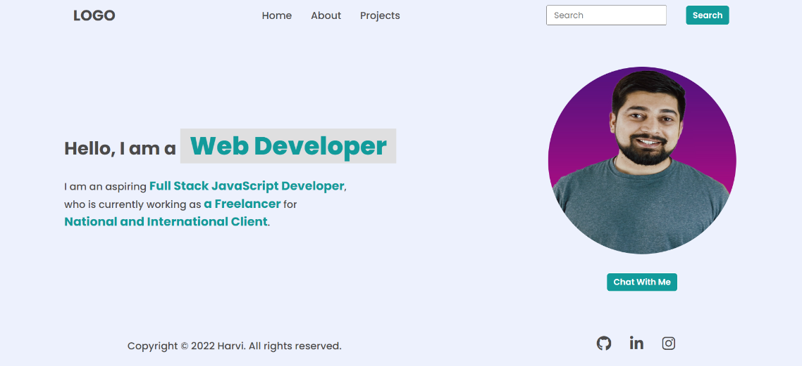
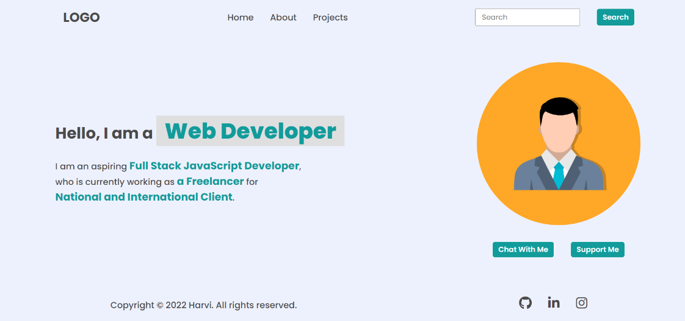
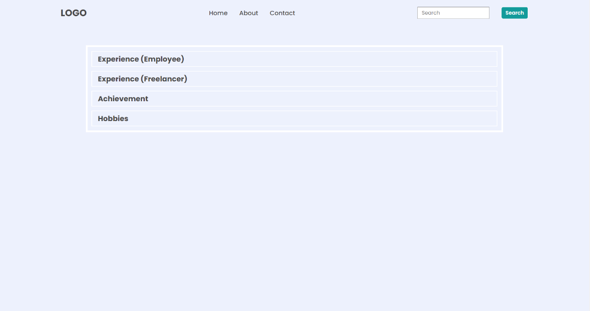
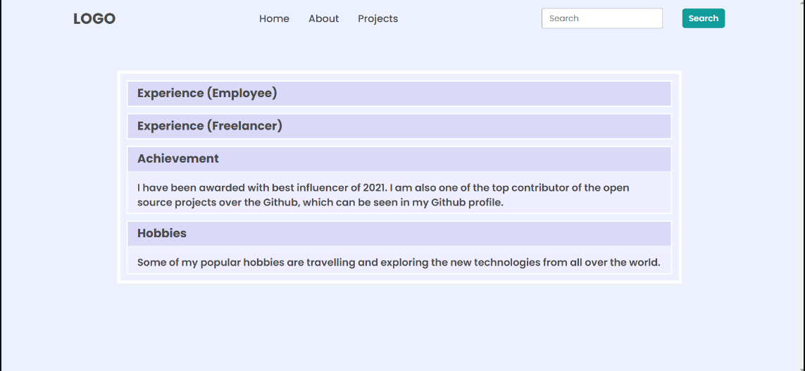
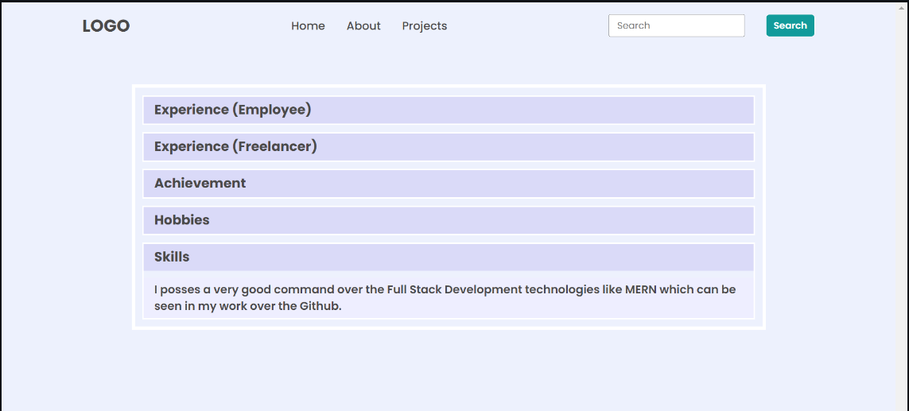

# DOM Assignment

### Question 1 Main Preview

### Task 1
Adding [hire me] button inside nav menu, change nav [Contact] button to [Projects] and Removeing footer social icons.

// code

// Add Hire me inside nav menu

let list = document.createElement("li");
let list_items = document.createTextNode("Hire Me");
list.appendChild(list_items);

let element = document.querySelector("ul");
element.appendChild(list);

// Change Contact to Projects

let lastitems = document.querySelector("header nav ul li:nth-child(3)");
lastitems.innerText = "Projects";

// Removeing Footer Social Icons

document.querySelector("footer ul").style.display = "none";

### Task 2
Changeing Header search field Placeholder text and hide [Hire Me] Button from nav menu.

// Changeing Search field Placeholder

let inputText = document.querySelector("header .search-field input");
inputText.placeholder = "Search My Project";

// Hide Hire me button from nav menu

let removeItems = document.querySelector("ul");
removeItems.removeChild(removeItems.children[3]);

### Task 3
Changeing hero paragraph span text and display footer social icons.

// Changeing Hero paragraph span text 

let heroAboutSpan1 = document.querySelector(
  ".hero-section .hero-left-section p span:nth-child(3)"
);
heroAboutSpan1.innerText = "an Employee";

let heroAboutSpan2 = document.querySelector(
  ".hero-section .hero-left-section p span:nth-child(5)"
);
heroAboutSpan2.innerText = "iNeuron Intelligence Pvt Ltd.";

// Display footer social icon

document.querySelector("footer ul").style.display = "flex";

### Task 4
Changeing hero avtar image and restore placeholder text.

// Change avtar image from hero section

let authorImage = document.querySelector(
  ".hero-section .hero-right-section img"
);

authorImage.src = "./HITESH CHOUDHARY.jpg";

// Restore placeholder text

let inputTextRestore = document.querySelector("header .search-field input");
inputTextRestore.placeholder = "Search";

### Task 5
Restore paragraph span text, Hero avtar image and adding a [Support Me] Button.

// Restore paragraph span text as original

let heroAboutSpan1Restore = document.querySelector(
  ".hero-section .hero-left-section p span:nth-child(3)"
);
heroAboutSpan1Restore.innerText = "a Freelancer";

let heroAboutSpan2Restore = document.querySelector(
  ".hero-section .hero-left-section p span:nth-child(5)"
);
heroAboutSpan2Restore.innerText = "National and International Client.";

// Restore avtar image

let authorImageRestore = document.querySelector(
  ".hero-section .hero-right-section img"
);

authorImageRestore.src = "./avtar.png";

// Add a [Support me] button

let supportMeBtn = document.createElement("button");
let supportMeBtnTxt = document.createTextNode("Support Me");
supportMeBtn.appendChild(supportMeBtnTxt);

let supportMe = document.querySelector(
  ".hero-section .hero-right-section .hero-right-section-btns"
);
supportMe.appendChild(supportMeBtn);

## Questin 2 Main Preview

### Task 1
Changing Accordian background color.

// Change H3 background color

let accordianH3Color = document.querySelectorAll(".accordian h3");
for (let i = 0; i < accordianH3Color.length; i++) {
  accordianH3Color[i].style.background = "#dadaf8";
}

// Change Accordian background color

let accordianPColor = document.querySelectorAll(".accordian");
for (let i = 0; i < accordianPColor.length; i++) {
  accordianPColor[i].style.background = "#edf1fd";
}

// Change contact button to [Project]

let lastitems = document.querySelector("header nav ul li:nth-child(3)");
lastitems.innerText = "Project";

### Task 2
Adding accordian

// Adding accordian

let accordianAdd = document.createElement("div");
let accordianWrapper = document.querySelector(".accordian-wrapper");
accordianWrapper.appendChild(accordianAdd);

// adding class name in new accordian

let element = document.querySelector(".accordian-wrapper div:last-child");
element.classList.add("accordian");

// Adding H3 inside accordian

let addH3 = document.createElement("h3");
let addH3text = document.createTextNode("Skills");
addH3.appendChild(addH3text);

let accordianHeading = document.querySelector(
  ".accordian-wrapper .accordian:last-child"
);
accordianHeading.appendChild(addH3);

addH3.style.background = "#dadaf8";

// Adding Paragraph inside accordian

let addpara = document.createElement("p");
let addptext = document.createTextNode(
  "I posses a very good command over the Full Stack Development technologies like MERN which can be seen in my work over the Github"
);
addpara.appendChild(addptext);

let accordianpara = document.querySelector(
  ".accordian-wrapper .accordian:last-child"
);
accordianpara.appendChild(addpara);

// Add click function in last accordian

let lastAccordian = document.querySelectorAll(".accordian:last-child h3");
lastAccordian.forEach((element) => {
  element.addEventListener("click", () => {
    let para = element.nextElementSibling;
    if (para.style.display === "block") {
      para.style.display = "none";
    } else {
      para.style.display = "block";
    }
  });
});

